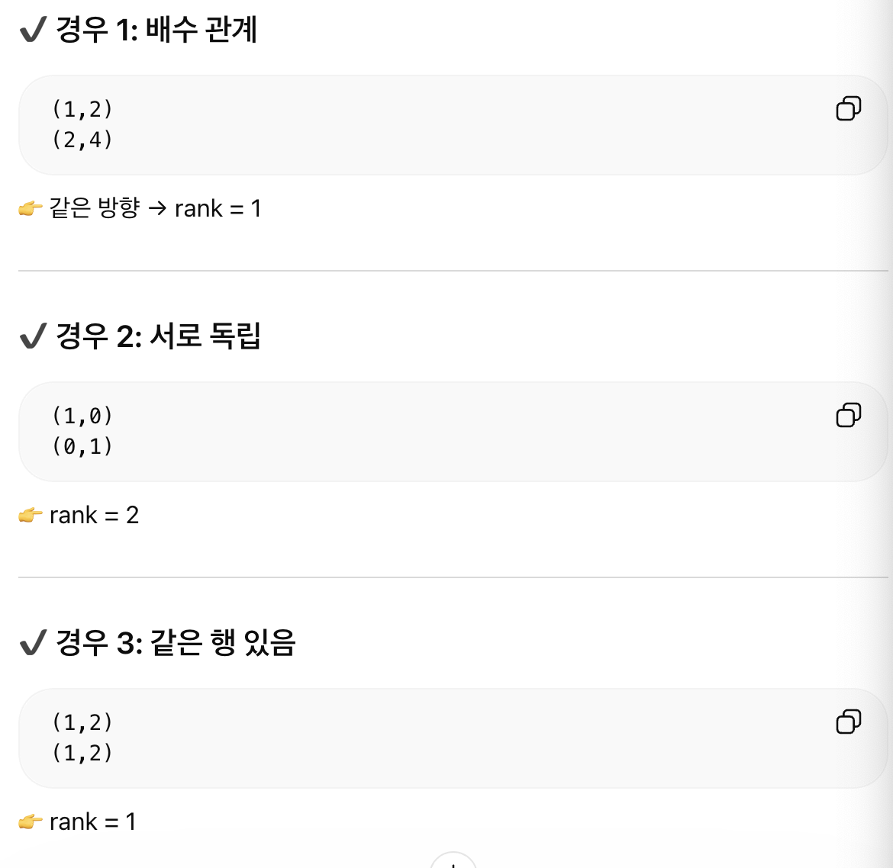
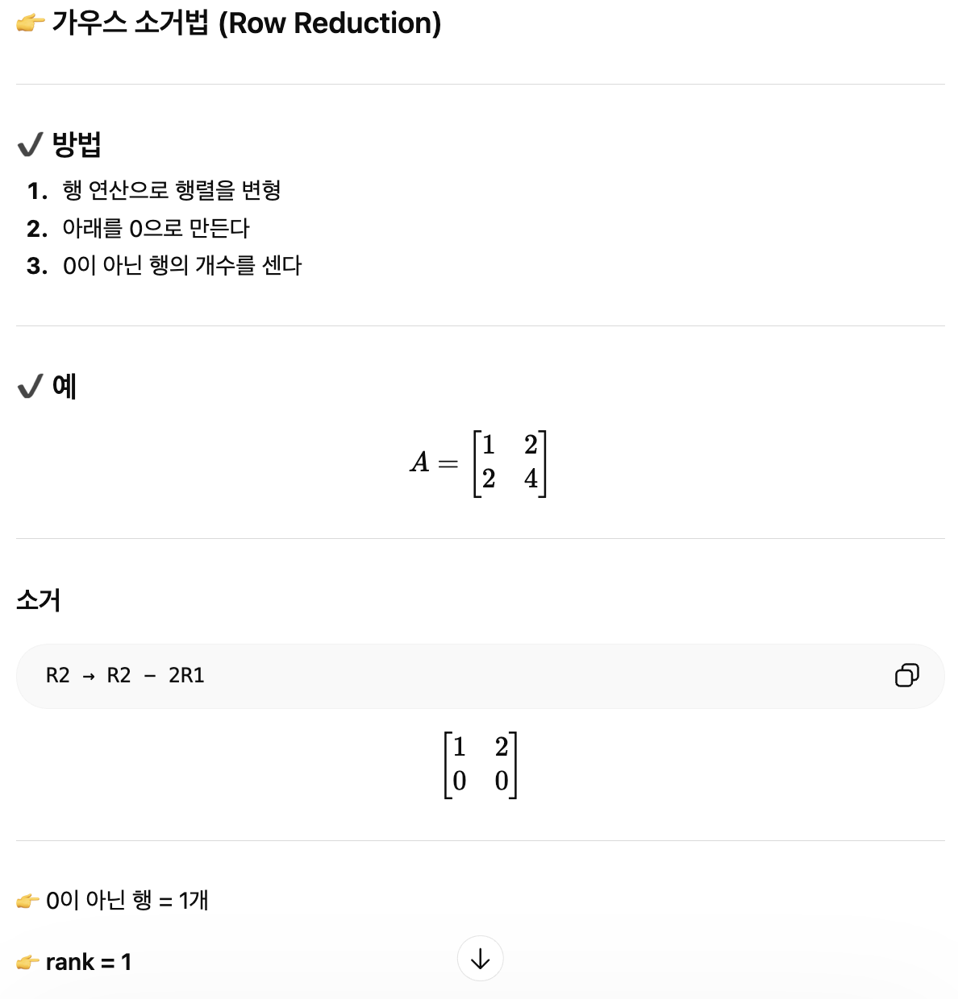

## 3 성질이 나쁜 경우
### 3.1 성질이 나쁜 예
- 단서가 부족한 경우(가로가 긴 행렬, 핵)
  - y가 x보다 차원이 작은(m < n) 경우
  - '납작하게 누르는' 사상: 정보를 버린다.
  - A의 핵(kernel)
    - Ax = o으로 이동해 오는 것과 같은 x의 집합
- 단서가 너무 많은 경우(세로가 긴 행렬, 상)
  - y가 차원이 큰 경우 (m > n)
- 단서의 개수가 일치해도....(특이행렬)
  - 납작하게 눌려버림

### 3.2 성질의 나쁜과 핵・상
- 단사: 같은 결과 y가 나오는 원인 x는 유일한가
- 전사: 어떤 결과 y에도 그것이 나오는 원인 x가 존재하는가
- 전단사: 단사, 전사가 성립하는 경우

### 3.3 차원 정리
- 차원 정리: 전체 차원 = 살아남은 차원 + 사라진 차원
- 수식
  - dim(입력공간) = rank + nullity

### 3.4 '납작하게'를 식으로 나타내다(선형독립, 선형종속)
- 선형종속: a1, ..., an != 0
  - 적어도 하나의 계수가 0이 아닌 해가 존재
  - 납작하게 눌린다
- 선형독립: a1, ..., an = 0
  - 모든 계수가 0인 경우
  - 납작하게 눌리지 않는다
- 기저와 선형독립
  - 기저는 선형독립이면서 모든 벡터를 표현 가능

### 3.5 단서의 실질적인 개수(랭크)
- 이동점의 공간 전체를 커버할 수 있는가? - m차원인가?
- 랭크의 정의
  - 몇 개의 '독립적인 방향'이 살아남았냐
  - 공간의 실제 차원
- 랭크와 핵, 상과 단사, 전사
  - rank(A) = n ⇔ 단사 (Injective)
    - 입력 정보가 하나도 안 사라진다
  - rank(A) = m ⇔ 전사 (Surjective)
    - 출력 공간을 전부 커버한다
- 랭크의 기본 성질
  - rank A ≤ m
  - rank A ≤ n
  - 랭크는 m이나 n보다 클 수 없다
- 보틀넥 형의 분해
  - 행렬 A를 분해 할 수 있다.
    - A = BC
- 실질적인 단서의 개수
  - ?
- 전치해도 랭크는 동일

### 3.6 랭크 구하는 방법 (1) 눈으로
- 
### 3.7 랭크 구하는 방법 (2) 손 계산
- 

## 4 성질의 좋고 나쁜의 판정 (역행)
### 4.1 '납작하게 눌리는가'가 포인트
- '납작하게 눌리지 않는다'는 'Ker A가 원점 o뿐'이라고 말할 수 있다.
- rank A = n

### 4.2 정칙성과 같은 조건 여러 가지
### 4.3 정칙성의 정리
- 책 읽어보기

## 5 설질이 나쁜 경우의 대책
### 5.1 구할 수 있는 데까지 구한다 (1) 이론편
- 해가 존재하는가?
  - y가 lm A에 속한다.
  - lm: A에 따라 움직일 수 있는 이동점의 집합
- 해를 모두 찾자
  - 특해: 힘을 내서 하나 발견된 해 x0
  - 동차방정식의 일반해를 구한다.
  - Ax = y의 해는 특해 + 동차방정식의 일반해

### 5.2 구할 수 있는 곳까지 구한다 (2) 실전편
- 단서가 너무 많은 전형적인 예(해 없음)
  - 마지막 식이 0 = 4가 나오면 해가 없음
- 단서가 부족한 전형적인 예(해가 많음)
  - x3, x4는 임의의 수 대입
- 도중에 길이 막힌 경우
  - 순서를 변경
- 도중에 정말로 벽에 부딪힌 경우(막힌 경우)
  - 해가 없습니다.
- 정리
  - 책 참고: *이 모두 0이면 해 있음 / 하나라도 0이 아닌 값이면 해 없음

### 5.3 최소제곱법
- 특이값분해나 일반화역행렬이란 도구 활용

## 6 현실적으로 성질이 나쁜 경우
### 6.1 무엇이 곤란한가
- 납작하게 누르는 것을 되돌리면 노이즈도 확대된다.
- 그림 2-24: 이미지 압축
### 6.2 대책 예: 티호노프의 정칙화
- 티호노프 정칙화는 노이즈와 불안정을 줄이기 위해 해의 크기를 제한하는 방법이다

