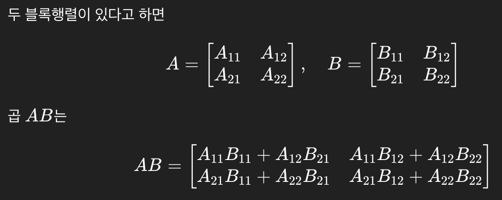
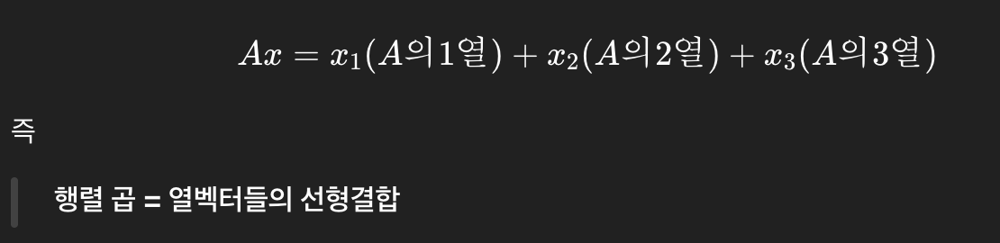

### 2.9 블록행렬
- 블록행렬: 행렬의 종횡에 단락을 넣어 각 구역을 작은 행렬로 간주한 것
- 블록행렬의 덧셈
  - 같은 위치의 블록끼리 더한다
- 블록행렬의 정수배
  - 블록행렬에 어떤 수 c를 곱하면 모든 블록에 동일하게 그 수를 곱한다
- 블록행렬의 곱
  - 
- 행벡터, 열벡터
  - nx1이나 1xn처럼 한 방향으로만 나누는 벡터를 열벡터/행벡터라고 한다.
  - 
- 블록대각행렬
  - '\' 방향의 대각선상 블록이 모두 정방행렬이고, 그 외의 블록이 모두 영행렬인 것
  - 대각블록: 대각성분에 대응하는 행렬

### 2.10 여러 가지 관계를 행렬로
- 고계 차분, 고계 미분
  - '다음 번의 상태는 최초의 상태로부터 결정된다'라는 모델은 시계열분석의 기초로 사용
  - 고계 차분: 차이를 여러 번 구한 것 (데이터 변화 패턴을 반복해서 보는 것)
    - 차분: 데이터 간의 차이
  - 고계 미분: 미분을 여러 번 한것 (변화의 변화를 계속 보는 것)
    - 미분: x가 연속적으로 변할 때 변화율
- 정수항의 나
- 눗셈(제법)
  - 역수를 곱하는 형태로 바꾸면 행렬곱 형태롤 표현할 수 있다?

### 2.11 좌표 변환과 행렬
- 좌표 변환
  - '정방행렬 A를 곱한다'라는 형태로 쓸 수 있다.
  - 역행렬을 지니는 정방행렬 A를 곱하는 것은 좌표 변환이라고 해석할 수 있다.
- 좌표 변환을 행렬로 쓰다
  - 벡터를 바꾸는 게 아니라 “표현 방식”을 바꾸는 것이다.
  - 예시
    > 방법 1: 집에서 3km, 오른쪽 2km
    > 방법 2: 지하철 기준 1정거장, 왼쪽 1km

### 2.12 전치행렬 = ???
- 행렬 A의 행가 열을 바꿔넣는 것
- 복소공역: 복소수에서 허수 부분의 부호를 바꾸는 것
- 공역전치: 전치 + 복소경역을 동시에 적용
  

## 행렬식과 확대율

### 3.1 행렬식 = 부피 확대율
- 행렬식: 행렬이 공간을 얼마나 "늘리거나 줄이는지"를 나타내는 값
  - 면적 확대율은 원래 도형의 위치나 모양과 관계 없음
  - 도형이 뒤집힌 경우 음의 확대율로 나타내기도 한다.
  - 납작하게 되는 경우는 확대율이 0

### 3.2 행렬식의 성질
- 한눈에 들어오는 성질
  - det(I) = 1
    - 단위행렬의 행렬식은 1이다.
  - det(A^T) = det(A)
    - 전치해도 행렬식은 변하지 않는다.
  - det(AB) = det(A) · det(B)
    - 곱의 행렬식은 각각의 행렬식의 곱이다.
  - det(A⁻¹) = 1 / det(A)
    - 역행렬이 존재하면 행렬식은 역수 관계이다.
- 유용한 성질
  - 어느 열의 정수배를 다른 열에 더해도 값이 변하지 않는다.
  - 상삼각행렬: 대각성분보다 아래 쪽이 모두 0인 행렬
- 전치행렬의 행렬식
  - 행렬식의 성지로가 행과 열의 역할을 모두 바꿔도 성립
- 열쇠가 되는(중요한) 성질
  - 다중선형성: 행렬식은 “각 행(또는 열)”에 대해 선형이다

