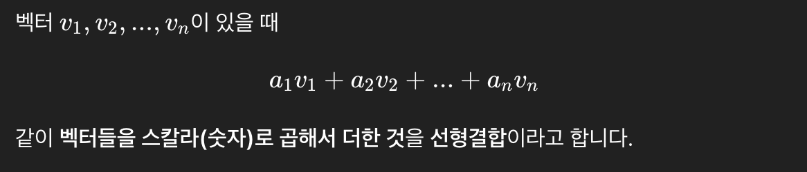

# 벡터・행렬・행렬식

## 1. 벡터와 공간
### 1.1 우선적인 정의: 수치의 조합을 정리하여 나타내는 기법
- 수를 나열한 것을 벡터
- 벡터라고 하면 보통은 세로로 늘어선 '종벡터'를 의미
- 덧셈, 정수배와 같은 연산도 정의 가능

### 1.2 '공간'의 이미지
- 2차원 벡터는 모눈종이 위에 점으로 찍을 수 있다.
- 위치에 대응시키는 것을 강조할 때는 '위치 벡터'라고 부른다.
- 원점 0에서 그 위치를 향하는 '화살표'

### 1.3 기저
- 선형 공간
  - '덧셈'과 '정수배'가 정의된 세계
  - 벡터 공간이라고도 부른다.
  - 현실 공간을 어느 수준에서 추상화한 것
- 아핀 공간
  - 선형 공간에서 원점을 지워버린 세계

### 1.4 기저가 되기 위한 조건
- 모든 토지에 번지(좌표)가 붙어 있다.
- 토지 하나에 번지는 하나뿐이다.
- 선형결합
  
  ```
  v1​=(1,0)
  v2​=(0,1)
  2v1​+3v2​
  (2,3)
  ```

### 1.5 차원
- 기저 벡터의 개수를 가지고 그 공간의 차원을 정의
  - 차원 = 기저 벡터의 개수 = 좌표의 성분수

### 1.6 좌표에서의 표현
- 좌표에 '기저'를 지정하지 않으면 의미가 X
- 어떤 기저를 취하여 좌표를 표시해도 덧셈과 정수배는 좌표 성분마다 덧셈과 정수배가 된다.


## 2. 행렬과 사상
### 2.1 우선적인 정의: 순수한 관계를 나타내는 편리한 기법
- 수를 직사각형 형태롤 나열한 것을 행렬
- 정방행령: 행 수와 열 수가 같은 행렬
- 성분: 행렬 A의 i행과 j열의 값을 A의 (i, j) 성분
- 곱에 대한 주의 사항
  - 행렬과 벡터의 곱은 벡터
  - 행렬의 열 수(가로폭)가 '입력'의 차원 수, 행 수(높이)가 '출력'의 차원 수
  - 입력이 종벡터를 가로로 넘겨 딱딱 계산하는 느낌

### 2.2 여러 가지 관계를 행렬로 나타내다 (1)

### 2.3 행렬은 사상이다
- 원점 0는 원점 0 그대로
- 직선은 직선에 이동한다.
- 평행선은 평행선에 이동한다.
- mxn 행렬 Asms n차원 공간을 m차원 공간에 옮기는 사상

### 2.4 행렬의 곱 = 사상의 합성
- 오른쪽 행렬을 세로 단락으로 분해
- 분해한 각각에 왼쪽 행렬을 곱한다.
- 결과를 접착

### 2.5 행렬 연산의 성질
- 기본적인 성질
  - (cA)x = c(Ax) = A(cx)
  - (A + B)x = Ax + Bx
  - A + B = B + A
  - (A + B) + C = A + (B + C)
  - (c + c')A = cA + c'A
  - (cc')A = c(c'A)
  - A(B + C) = AB + AC
  - (A + B)C = AC + BC
  - (cA)B = c(AB) = A(cB)
- 벡터로 행렬의 일종?
  - n차원 벡터를 n X 1 행렬로 간주해도 결과는 동일

### 2.6 행렬의 거듭제곱 = 사상의 반복
- 제곱은 가감승산보다 먼저 계산하는 규칙

### 2.7 영행렬, 단위행렬, 대각행렬
- 영행렬
  - 모든 성분이 0인 행렬
  - 모든 것을 원점으로 이동시키는 사상
- 단위행렬
  - 대각선위만 1이고 다른 것은 모든 0인 행렬
  - 기호 I로 나타낸다.
- 대각행렬
  - 정방행렬의 '＼' 방향의 대각선상의 값을 대각성분
  - 대각성분 이외의 값을 비대각성분
  - 비대각성분이 모두 0인 행렬을 대각행렬

### 2.8 역행렬 = 역사상
- 정의
  - 정방행렬 A에 대해 그 역사상에 대응하는 행렬을 'A의 역행렬'이라고 하고 기호 A<sup>-1</sup>이라고 쓴다.
- 납작하게 눌리는 경우는 역행렬이 존재 X
- 기본적인 성질
  - (A<sup>-1</sup>)<sup>-1</sup> = A
    - 'A의 취소'를 취소하려면 A하면 된다.
  - (AB)<sup>-1</sup> = B<sup>-1</sup>A<sup>-1</sup>
    - 'B하고 A한 것'을 원래대로 돌려놓으려면 A부터 취소하고 B를 취소해야 한다.
  - (A<sup>k</sup>)<sup>-1</sup> = (A<sup>-1</sup>)<sup>k</sup>
    - A를 k번한 것을 원래대로 돌려놓으려면 'A의 취소'를 k번, 이를 A<sup>-k</sup>라고 줄여 쓴다.
- 정방행렬 X와 역행렬 Y의 증명
  - XY = I
- 대각행렬의 경우
  - BA = I
  - B는 A의 역행렬 A<sup>-1</sup>