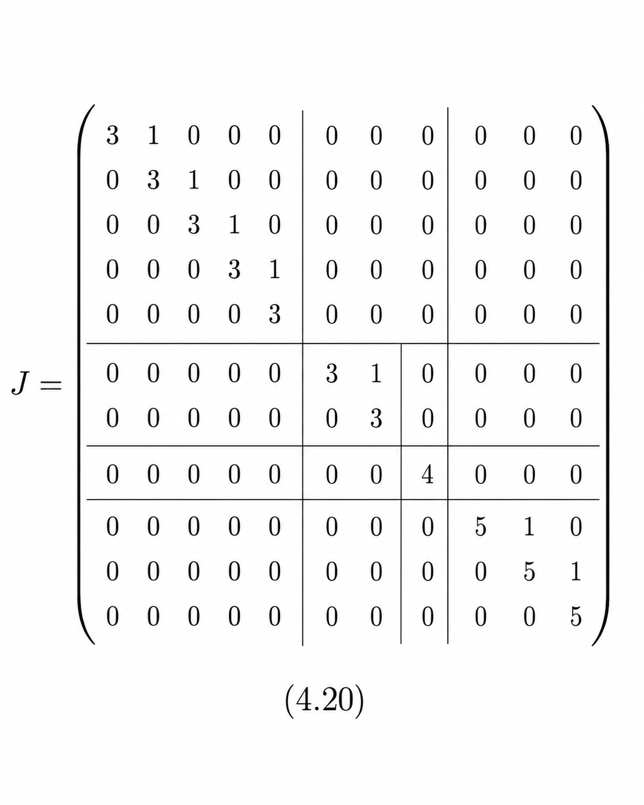
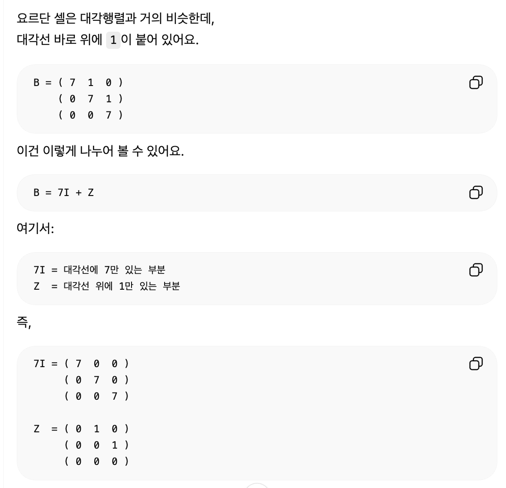

## 6 연속시간 시스템
- 대부분의 물리 현상은 시각 t가 연속인 미분방정식으로 설명

### 6.1 미분방정식
- 어떤 값이 어떻게 변하는지를 식으로 표현한 것
- 일반 방정식이 보통 "값"을 찾는 문제라면, 미분방정식은 "변화하는 규칙"을 보고 원래 함수나 미래의 움직임을 찾는 문제에 가깝다.
- 나뭇잎 배 예시: 미분방정식 + 행렬로 표현
  ```
  x1(t) = 가로 방향 위치
  x2(t) = 세로 방향 위치
  ```

  그래서 시간 t에서의 위치는 벡터로 나타낼 수 있다.
  - x(t) = (x1(t), x2(t))

  예를 들어 초기 위치가 다음과 같다면,
  - x1(0) = 4
  - x2(0) = 6

  이는 처음에 나뭇잎 배가 좌표 (4, 6)에 있다는 뜻이다.
  - x(0) = (4, 6)

  미분방정식은 이 위치가 시간에 따라 어떻게 변하는지를 나타낸다.
  - d/dt x1(t) = 3x1(t) - 2x2(t)
  - d/dt x2(t) = x1(t)

  이 식은 각각 다음을 의미한다.
  - x1의 변화 속도 = 3x1 - 2x2
  - x2의 변화 속도 = x1

  즉, 현재 위치가 어디냐에 따라 다음 순간의 이동 방향과 속도가 결정된다는 뜻이다.

  처음 위치 (4, 6)을 대입해보면,
  - d/dt x1(0) = 3(4) - 2(6) = 0
  - d/dt x2(0) = 4

  따라서 처음 순간에는 가로 방향으로는 거의 움직이지 않고,
세로 방향으로는 위쪽으로 움직인다고 해석할 수 있다.

### 6.2 1차원일 때
- 이 절에서는 가장 단순한 형태의 미분방정식을 다룬다.
  ```text
  d/dt x(t) = ax(t)
  ```

  이 식은 x(t)의 변화율이 현재 값 x(t)에 비례한다는 뜻이다.
즉, 현재 값이 클수록 더 빠르게 변하고, 현재 값이 작으면 변화도 작다.

  예를 들어,
  ```
  d/dt x(t) = 7x(t)
  ```
  라면 x(t)의 변화 속도가 현재 값의 7배라는 의미다.

  이 미분방정식의 해는 다음과 같다.
  ```
  x(t) = e^(7t)x(0)
  ```
  여기서 x(0)은 처음 값이다.
  즉, 처음 값이 시간이 지나면서 e^(7t)만큼 커진다.

  일반적으로는 다음과 같이 쓸 수 있다.
  ```
  d/dt x(t) = ax(t)
  x(t) = e^(at)x(0)
  ```
  중요한 것은 a의 부호다.
  ```
  a > 0 : 시간이 지날수록 증가, 폭주 가능
  a = 0 : 변화 없이 유지
  a < 0 : 시간이 지날수록 감소, 수렴
  ```

### 6.3 대각행렬일 때
- 이번에는 1차원이 아니라 여러 차원의 미분방정식을 다룬다.
  행렬 A가 대각행렬이면 계산이 단순해진다.
  ```
  A = ( 5   0   0 )
      ( 0   3   0 )
      ( 0   0  -8 )
  ```
  라면 각 성분은 서로 섞이지 않고 따로 변한다.
  ```
  d/dt x1(t) = 5x1(t)
  d/dt x2(t) = 3x2(t)
  d/dt x3(t) = -8x3(t)
  ```

  각각의 해는 다음과 같다.  
  ```
  x1(t) = x1(0)e^(5t)
  x2(t) = x2(0)e^(3t)
  x3(t) = x3(0)e^(-8t)
  ```

  대각성분의 부호
  ```
  5, 3  > 0  → 시간이 지날수록 증가
  -8    < 0  → 시간이 지날수록 감소
  ```
  그래서 이 시스템은 폭주할 위험이 있다고 판단할 수 있다.
  
### 6.4 대각화할 수 있는 경우
- 핵심은 복잡한 행렬 A를 좌표 변환을 통해 대각행렬처럼 만들고, 각 성분을 독립적으로 풀기 쉽게 만드는 것이다.
- 정칙행렬 P는 일반 행렬 A를 더 쉬운 좌표계로 바꾸기 위한 변환 도구이고,
P^(-1)AP가 대각행렬 D가 되면 A를 대각행렬처럼 다룰 수 있다.

### 6.5 결론: 고윳값(실수부)의 부호
- 대각화할 수 있는 경우 A의 고윳값의 실수부가
  - Re λ1, ..., Re λn 중 하나라도 양수이면 폭주
  - Re λ1, ..., Re λn ≤ 0 (모두 ≤ 0)이면 폭주하지 않음

## 7 대각화할 수 없는 경우

### 7.1 먼저 결론
- 행렬 `A`를 대각화할 수 있으면 각 고윳값을 보고 시스템이 폭주하는지 판단할 수 있다.  
- 하지만 `A`가 항상 대각화되는 것은 아니기 때문에, 이 절에서는 **대각화할 수 없는 경우에도 쓸 수 있는 폭주 판정 기준**을 먼저 정리한다.
- 이산 시간에서는 고윳값 λ의 절대값이 중요하다
  - 고윳값 중 하나라도 |λ| > 1이면 폭주한다.
  - 모든 고윳값이 |λ| < 1이면 폭주하지 않는다
  - 모든 고윳값이 |λ| ≤ 1이어도, |λ| = 1인 고윳값이 있으면 고윳값만으로는 판단할 수 없다.
- 연속시간에서는 고윳값 λ의 실수부 Re(λ)가 중요하다.
  - 고윳값 중 하나라도 Re(λ) > 0이면 폭주한다.
  - 모든 고윳값이 Re(λ) < 0이면 폭주하지 않는다.- 모든 고윳값이 Re(λ) ≤ 0이어도, Re(λ) = 0인 고윳값이 있으면 고윳값만으로는 판단할 수 없다.

즉, 연속시간에서는 고윳값이 복소평면의 왼쪽 영역에 있는지를 본다.
```
Re(λ) < 0 : 안전
Re(λ) > 0 : 위험
Re(λ) = 0 : 경계라서 추가 판단 필요
```

### 7.2 대각까지는 못하더라도 - 요르단 표준형
- 요르단 표준형이라면 반드시 변환 가능
- 정방행렬 A에 대해 크기가 같은 정칙행렬 P를 골라 p<sup>-1</sup>AP = J가 요르단 표중형이 되도록 할 수 있다.
- 요르단 표준형의 예시
  
  - 블록대각(블록정방행렬이고, 대각블록 이외는 모두 0)
  - 대각블록은 다음과 같은 성질을 지닌다.
    - 대각성분에 같은 수가 나열
    - 하나 오른쪽 위는 1이 비스듬히 늘어선다.
이런 블록을 *요르단 셀*이라고 합니다.

### 7.3 요르단 표준형의 성질
- 주요 장점
  - 고윳값, 고유벡터의 모양이 보인다.
  - 거듭제곱을 구체적으로 계산할 수 있다.

### 요르단 표준형의 고윳값
- ‘고윳값 3은 7중해인데 선형독립인 고유벡터는 두 개 밖에 없다’,
- ‘고윳값 5는 3중해인데 선형독립인 고유벡터는 한 개밖에 없다’라는 ‘성질이 나쁜 경우(→ 4.5.4절)’가 되므로 대각화는 불가능합니다.
- 그래서 대각화 가능 여부는 단순히 고윳값이 몇 개인지만으로 판단하지 않고,
충분한 수의 고유벡터가 있는지를 봐야 한다.

### 요르단 표준형의 거듭제곱
- 
- Z는 “옆으로 미는 역할”을 한다
- 즉, 요르단 표준형에서는 고윳값뿐 아니라 요르단 셀의 크기와 연결 구조도 함께 봐야 한다.

### 7.4 요르단 표준형으로 초깃값 문제를 풀다(폭주 판정의 최종 결론)
- 요르단 표준형에서는 요르단 셀마다 서브 시스템으로 분해된다.
- 분해되면
  - 서브 시스템 중 하나라도 '폭주의 위험이 있다'면 전체도 '폭주의 위험이 있다'
  - 서브 시스템이 모두 '폭주하지 않는다'면 전체도 '폭주하지 않는다'

### 이산시간 시스템
- |λ| > 1이면 폭주한다.
- |λ| = 1인 경우는 B의 크기 m 나름이다.
- m ≥ 2이면 폭주한다.
- m = 1이면 폭주하지 않는다.
- |λ| < 1이면 폭주하지 않는다.

### 연속시간 시스템
- Re λ > 0이면 폭주한다.
- Re λ = 0인 경우는 B의 크기 m나름이다.
  - m ≥ 2이면 폭주한다.
  - m = 1이면 폭주하지 않는다.
- Re λ < 0이면 폭주하지 않는다.