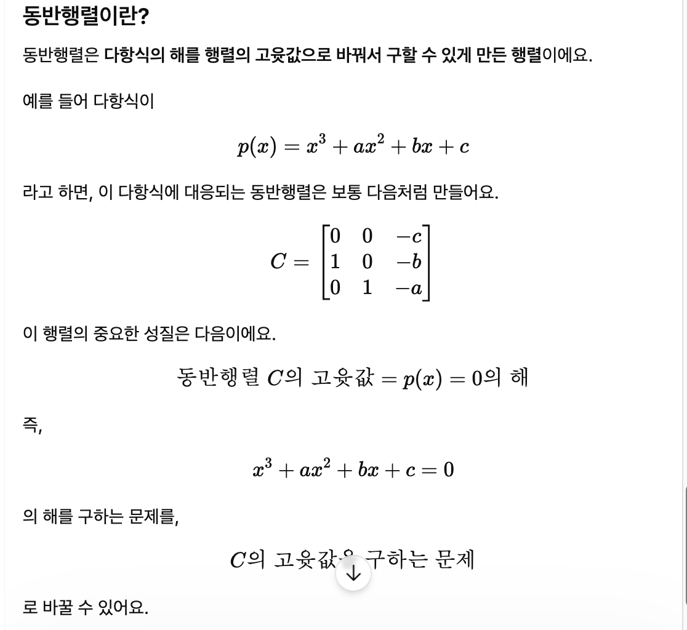

# 1 문제 설정: 안정성

## 1.1 손 계산과 차이점
- 컴퓨터에서 고윳값을 수치적으로 계산할 때 사용하는 방법을 손계산과 꽤 다르다.
  - 차수가 높은 대수방정식의 해를 컴퓨터로 구하는 경우 대수방정식의 랭크에 조금이라도 오차가 있으면 구해진 해의 정확도가 상당히 나쁘다.
  - 행렬의 고윳값을 수치적으로 구할 때는 주어진 행렬 A를 대각화 또는 상삼각화 하는 방법을 사용

## 1.2 갈루아 이론
- 5차 미만의 대수방정식에는 해의 공식이 존재한다는 이론
  - 대수 방정식: 다음과 같은 n차방정식의 총칭
    ```
    ax + b = 0
    ax<sup>2</sup> + bx + c = 0
    ...
    ```
  - 해의 공식: 랭크 a, b, ...의 값에서 방정식을 만족시키는 x를 가감승제와 거듭제곱으로 구하는 공식
    - 일차방정식
      $$
      x = -\frac{b}{a}
      $$

    - 이차방정식
      $$
      x = \frac{-b \pm \sqrt{b^2 - 4ac}}{2a}
      $$ 
    - 삼차방정식: 카르다노의 방법
    - 사차방정식: 페라리의 방법
  - '절차'가 있다면 '공식'이 만들어진다.

## 1.3 5.5이상 행렬의 고윳값을 구하는 순서를 존재하지 않는다!
- 동반 행렬: 다항식 하나를 행렬 하나로 바꿔놓은 것



## 대표적인 고윳값 계산 알고리즘
- '닮음변환을 반복하여 행렬을 차차 대각행렬에 근접해간다'라는 반복계산을 사용

---

# 2 야코비법
- 실대칭행렬의 '모든 고윳값을 구한다'는 알고리즘

## 2.1 평면 회전
- n차원 공간 안에서, 딱 두 좌표축 p와 q가 만드는 평면만 회전시키고 나머지 좌표는 그대로 두는 변환이에요.
# 3차원 공간에서의 평면 회전

## 2.1.1. 평면 회전이란?

3차원 공간에서의 평면 회전은  
**세 좌표축 중 두 좌표축이 만드는 평면만 회전시키고, 나머지 한 좌표는 그대로 두는 변환**이다.

예를 들어 3차원 벡터가

$$
x =
\begin{bmatrix}
x_1 \\
x_2 \\
x_3
\end{bmatrix}
$$

일 때,  
어떤 두 좌표만 골라 회전시키는 것이다.

---

## 2.1.2. 3차원 회전 예시

3차원에서는 세 가지 대표적인 평면 회전을 생각할 수 있다.

---

## - R(θ,1,2)

$$
R(\theta, 1, 2) =
\begin{bmatrix}
\cos\theta & -\sin\theta & 0 \\
\sin\theta & \cos\theta & 0 \\
0 & 0 & 1
\end{bmatrix}
$$

### 의미

이 행렬은 **1번 좌표와 2번 좌표만 회전**시킨다.

즉,

$$
x_1, x_2
$$

는 회전하고,

$$
x_3
$$

는 그대로 유지된다.

### 좌표 변화

$$
\begin{bmatrix}
x_1 \\
x_2 \\
x_3
\end{bmatrix}
\rightarrow
\begin{bmatrix}
x_1\cos\theta - x_2\sin\theta \\
x_1\sin\theta + x_2\cos\theta \\
x_3
\end{bmatrix}
$$

### 직관

- \(x_1\)-\(x_2\) 평면에서 회전
- \(x_3\) 방향은 변하지 않음

즉,

```text
xy평면에서 회전하고 z축은 그대로 둔다
```

---

## - R(θ,2,3)

$$
R(\theta, 2, 3) =
\begin{bmatrix}
1 & 0 & 0 \\
0 & \cos\theta & -\sin\theta \\
0 & \sin\theta & \cos\theta
\end{bmatrix}
$$

### 의미

이 행렬은 **2번 좌표와 3번 좌표만 회전**시킨다.

즉,

$$
x_2, x_3
$$

는 회전하고,

$$
x_1
$$

은 그대로 유지된다.

### 좌표 변화

$$
\begin{bmatrix}
x_1 \\
x_2 \\
x_3
\end{bmatrix}
\rightarrow
\begin{bmatrix}
x_1 \\
x_2\cos\theta - x_3\sin\theta \\
x_2\sin\theta + x_3\cos\theta
\end{bmatrix}
$$

### 직관

- \(x_2\)-\(x_3\) 평면에서 회전
- \(x_1\) 방향은 변하지 않음

즉,

```text
yz평면에서 회전하고 x축은 그대로 둔다
```

---

## - R(θ,1,3)

$$
R(\theta, 1, 3) =
\begin{bmatrix}
\cos\theta & 0 & -\sin\theta \\
0 & 1 & 0 \\
\sin\theta & 0 & \cos\theta
\end{bmatrix}
$$

### 의미

이 행렬은 **1번 좌표와 3번 좌표만 회전**시킨다.

즉,

$$
x_1, x_3
$$

는 회전하고,

$$
x_2
$$

는 그대로 유지된다.

### 좌표 변화

$$
\begin{bmatrix}
x_1 \\
x_2 \\
x_3
\end{bmatrix}
\rightarrow
\begin{bmatrix}
x_1\cos\theta - x_3\sin\theta \\
x_2 \\
x_1\sin\theta + x_3\cos\theta
\end{bmatrix}
$$

### 직관

- \(x_1\)-\(x_3\) 평면에서 회전
- \(x_2\) 방향은 변하지 않음

즉,

```text
xz평면에서 회전하고 y축은 그대로 둔다
```

---

## 3. 세 회전행렬 비교

| 회전행렬 | 회전되는 좌표 | 그대로인 좌표 | 직관 |
|---|---|---|---|
| \(R(θ, 1, 2)\) | \(x_1, x_2\) | \(x_3\) | xy평면 회전 |
| \(R(θ, 2, 3)\) | \(x_2, x_3\) | \(x_1\) | yz평면 회전 |
| \(R(θ, 1, 3)\) | \(x_1, x_3\) | \(x_2\) | xz평면 회전 |

---

## 4. 핵심 정리

3차원 평면 회전은  
**세 좌표 중 두 좌표만 회전시키고, 나머지 한 좌표는 그대로 두는 변환**이다.

즉,

```text
R(θ, 1, 2) → x₁, x₂만 회전
R(θ, 2, 3) → x₂, x₃만 회전
R(θ, 1, 3) → x₁, x₃만 회전
```

---

## 2.2 평면 회전에 의한 닮음변환
## 2.3 계산 공부

---

# 3 거듭제곱의 원리

## 3.1 절댓값 최대의 고윳값을 구하
## 3.2 절댓값 최소의 고윳값을 구하
### 3.3 QR 분해
### 3.4 모든 고윳값을 구하는 경우

---

# 4 QR법

# 4.1 QR법의 원리
# 4.2 헤센버그 행렬
# 4.3 하우스홀더 법
# 4.4 헤센버그 행렬의 QR 반복
# 4.5 원점이동, 감차

---

# 5 연박본법
