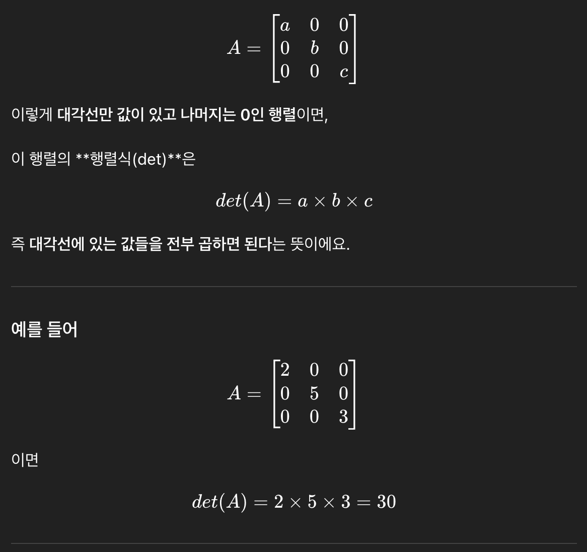
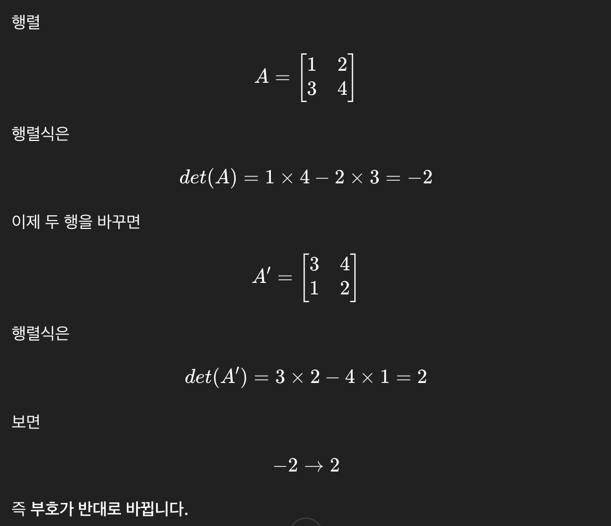

## 대각행렬 관찰
- 대각행렬의 행렬식 = 대각성분의 곱

- 대각성분에 0이 있으면 = 0
- 음수까지 가면 뒤집힌다.

## 고윳값·고유벡터와 대각화의 관찰
- 일반 행렬
  - 비틀어짐
  - 구부러지는 것이 아니라 직선은 직선, 평행은 평행인 채로
- 고유벡터
  - 어떤 행렬로 변환했을 때 “방향이 바뀌지 않는 벡터”

## 랭크와 행렬의 정규성 관찰
- 행렬에 따라서는 공각이 납작하게 찌그러지는 경우도 있다.
  - 찌그러진다는 것은 이동한 곳의 차원이 원래보다 즐어든다는 것. = 고윳값 0
  - 특이행렬: 역행렬이 존재하지 않는 행렬
  - 역행렬
    - 어떤 변환을 했다가 완전히 원래 상태로 되돌릴 수 있으면 역행렬 존재
    - 행렬이 A면 역행렬 A−1

## 행렬식의 교대성
- 행렬에서 두 행(또는 두 열)을 서로 바꾸면, 행렬식의 부호가 바뀐다.
- det(A′) = −det(A)
