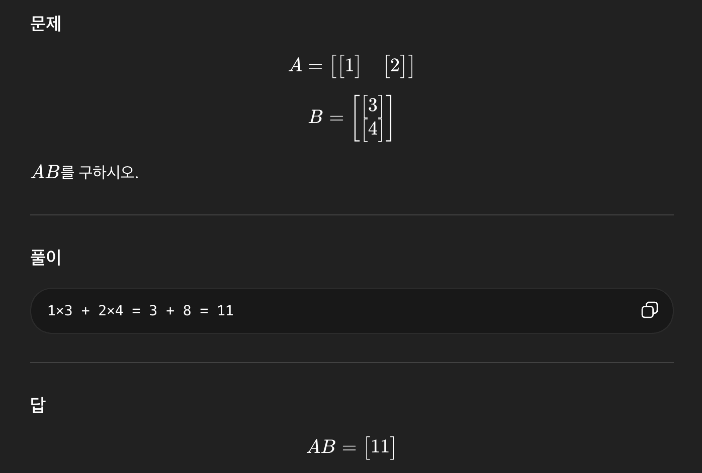
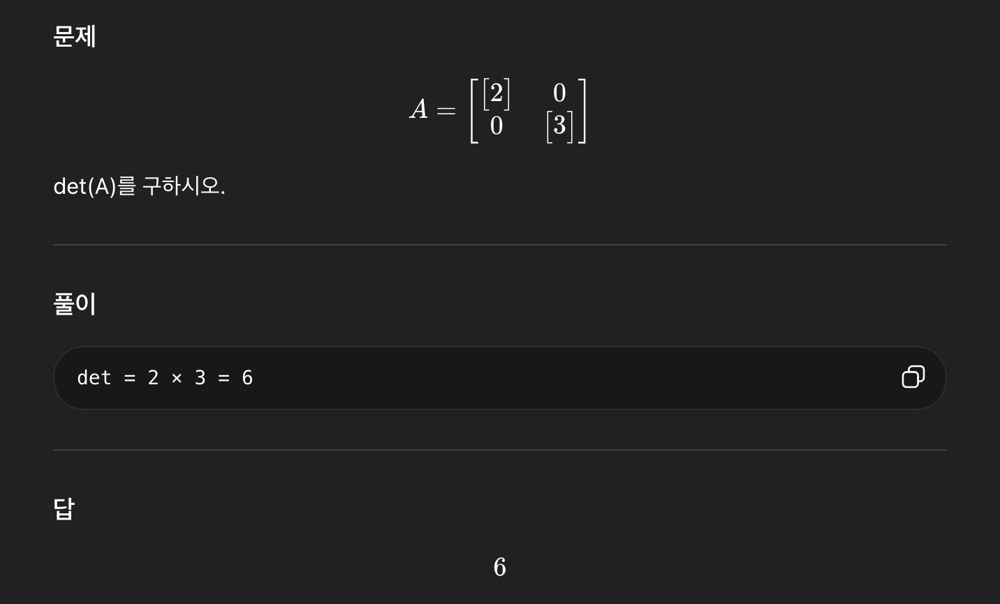

# AI 예제 1

블록행렬 덧셈
문제

다음 블록행렬을 더하시오.

A=[[1 2][3 4]]
B=[[5 6][7 8]]

---

풀이

같은 위치 블록끼리 더함:

```
[1 2] + [5 6] = [6 8]
[3 4] + [7 8] = [10 12]
```

답
A+B=[[6 8][10 12]]

# AI 예제 2
블록행렬 곱
- 

# AI 예제 3
블록대각행렬의 행렬식
- 


