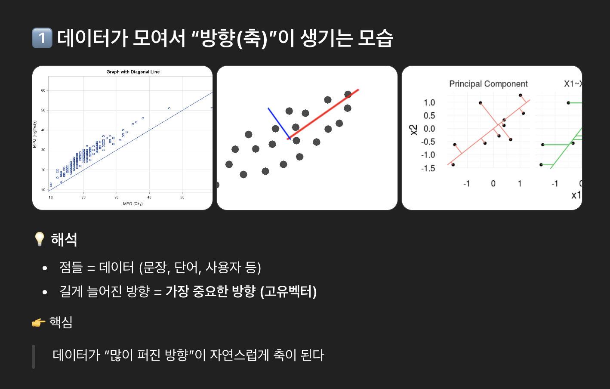
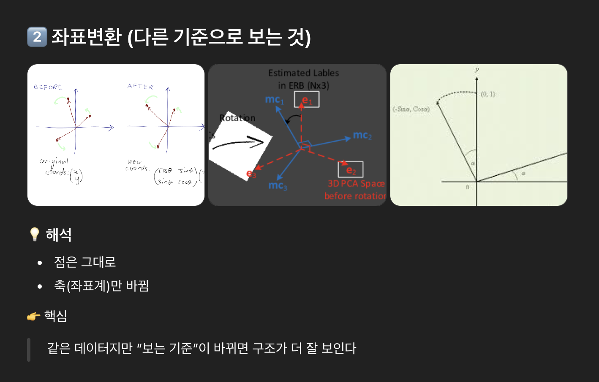
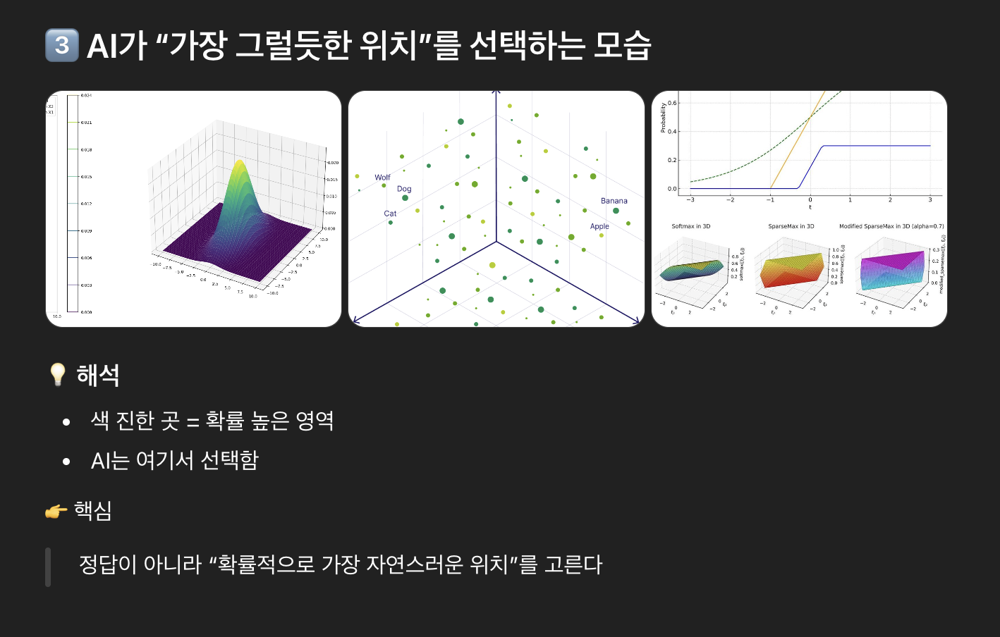

# Q1. 블록대각행렬은 무엇이고, 왜 중요한가? (AI와 연결해서 설명)
- 블록대각행렬은  
**여러 개의 독립적인 연산을 하나로 묶은 행렬**이다.

형태:
A =  
[ A₁   0   0  
  0   A₂   0  
  0    0  A₃ ]

---

### 1. 직관

이 구조는 이렇게 이해하면 쉽다.

> "큰 문제를 여러 개의 작은 문제로 나눠서 동시에 해결하는 것"

각 블록(A₁, A₂, A₃)은  
서로 영향을 주지 않고 **독립적으로 작동**한다.

---

### 2. 계산 특징

그래서 계산이 단순해진다.

Ax =
[ A₁x₁  
  A₂x₂  
  A₃x₃ ]

→ 전체를 계산하지 않고  
→ 각 블록만 따로 계산하면 된다

또한:

- det(A) = det(A₁) × det(A₂) × det(A₃)
- 역행렬도 블록별로 따로 계산 가능

---

### 3. 쉬운 비유

블록대각행렬은

> "여러 개의 프로그램을 동시에 실행하는 것"

예:
- A₁ = 이미지 처리
- A₂ = 텍스트 처리
- A₃ = 사용자 정보 처리

---

### 4. AI에서의 실제 활용

#### (1) Multi-Head Attention
- 여러 attention head를 동시에 실행
- 각 head는 독립적으로 계산

→ 하나의 큰 행렬로 보면 블록대각 구조

---

#### (2) Feature 분리 처리

입력:

x =
[ image  
  text  
  user ]

각각 다른 방식으로 처리:

- image → CNN
- text → Transformer
- user → MLP

→ 서로 영향을 주지 않음  
→ 블록대각 구조

---

#### (3) 추천 시스템

feature를 나눠서 처리:

- user feature
- item feature
- context feature

→ 각각 독립적으로 학습

---

#### (4) GPU 병렬 처리

큰 행렬을 여러 블록으로 나눠  
→ 여러 GPU에서 동시에 계산

# Q2. 그러면 ai에 의도적으로 자료 구조를 블록대각행렬로 구성하는거야? 근데 3X3의 블록대각행렬과 1X3의 행렬이 있을 때에도 블록대각행렬이 효율적이야? (단지 공간 자체가 넓으니까 비효율적이지 않을까 싶어서)

1️⃣ 먼저 핵심 답

❌ AI가 일부러 “블록대각행렬 형태로 저장”하진 않는다
⭕ 대신 구조적으로 블록처럼 동작하도록 설계한다

2️⃣ 왜 실제로는 블록대각행렬을 안 쓰냐

대각행렬을 실제 메모리에 저장하면
0이 엄청 많음 → 비효율

그래서 실제 구현에서는 A1, A2, A3 따로 저장 합니다.

3️⃣ 그럼 왜 블록대각행렬을 배우냐

개념적으로 구조를 이해하기 위해서
즉
"독립적인 연산 구조"
를 표현하는 수학적 언어입니다.

4️⃣ AI에서는 어떻게 쓰이냐 (중요)

실제 AI는 이렇게 합니다.

예: Multi-head attention
❌ (이렇게 안 함)
큰 블록대각행렬 만들기
⭕ (실제 방식)
head1 → 따로 계산
head2 → 따로 계산
head3 → 따로 계산

그리고 나중에

concat (이어붙임)

즉

물리적으로는 분리, 개념적으로는 블록대각

5️⃣ 당신 질문 2번 (핵심 질문)

3×3 블록대각행렬 vs 1×3 행렬 → 뭐가 효율적?
이건 상황에 따라 다르지만 핵심은 이거예요.

① 블록대각행렬
장점:
- 병렬 처리 가능
- 구조 분리 명확
- 독립적인 학습 가능

단점:
- 메모리 낭비 (0 많음)
- 실제 구현에서는 비효율
② 그냥 1×3 (혹은 일반 행렬)
장점:
- 메모리 효율 좋음
- 계산 최적화 쉬움

단점:
- 구조가 섞임
- 독립성 없음
6️⃣ 그래서 실제 AI는 이렇게 한다

👉 가장 중요한 포인트

“논리적으로는 블록 구조, 구현은 분리 계산”

즉

개념:
[ A1  0  0
  0  A2  0
  0  0  A3 ]

실제:
A1(x1)
A2(x2)
A3(x3)
7️⃣ 당신 질문의 핵심 insight

당신이 말한 이 부분 👇

“공간이 넓으니까 비효율적인 거 아닌가?”
이건 실제로 AI 엔지니어들이 고민하는 문제입니다.

그래서 등장한 것들:

- sparse matrix (희소행렬)
- low-rank decomposition
- parameter sharing
8️⃣ 한 줄 핵심

AI는 블록대각행렬을 직접 쓰지 않고, 그 구조를 “연산 방식”으로 구현한다

---

# Q3. AI에서 좌표변환과 고유벡터 (실제 서비스 관점)

---

## 1. 좌표변환 = 표현 바꾸기

### 📌 예시: 검색 서비스 (ChatGPT / 네이버 / 구글)

사용자 입력:

"강아지 사료 추천"

---

### 1) 텍스트 → 벡터

"강아지 사료 추천"  
→ [0.23, -0.51, 0.88, ...]

👉 이건 첫 번째 좌표계 (단어 중심 표현)

---

### 2) 좌표변환 (핵심)

모델 내부에서:

x → Wx

👉 행렬곱 = 좌표변환

---

### 3) 무엇이 바뀌는가

기존 좌표계:
- 단어 중심
- 표면적인 의미

변환 후:
- 의미 중심
- 문맥 반영

---

### 4) 직관

"강아지 사료 추천"  
↓  
"반려견 + 음식 + 추천 의도"

👉 같은 데이터, 표현만 바뀜

---

### 5) 실제 효과

"강아지 밥 뭐 줘?" 같은 문장도  
같은 의미로 인식 가능

👉 이유: 같은 의미 좌표계로 변환되었기 때문

---

### ✔ 한 줄 정리

> 좌표변환은 데이터를 더 잘 이해할 수 있는 형태로 바꾸는 과정이다

---

## 2. 고유벡터 = 가장 중요한 방향

### 📌 예시: 넷플릭스 / 유튜브 추천 시스템

---

### 1) 사용자 행동 데이터

- 액션 영화 많이 봄
- SF 선호
- 로맨스 비선호

---

### 2) 데이터 표현

사용자 = 고차원 벡터 (수백 ~ 수천 차원)

---

### 3) 문제

차원이 너무 많아서 이해하기 어려움

---

### 4) 해결: PCA (고유벡터 활용)

고차원 데이터를  
→ 중요한 몇 개의 축으로 축소

---

### 5) 직관적 변화

원래:

[장르1, 장르2, ..., 장르1000]

변환 후:

[액션 성향, 감정 성향, 실험성]

---

### 6) 의미

고유벡터 = 데이터가 가장 많이 퍼지는 방향  
→ 가장 중요한 정보 축

---

### 7) 실제 효과

유저 A → 액션 축 높음  
유저 B → 감정 축 높음  

👉 추천이 쉬워짐

---

### ✔ 한 줄 정리

> 고유벡터는 데이터를 가장 잘 설명하는 핵심 방향이다

---

## 3. 좌표변환 + 고유벡터 연결

좌표변환:
→ 데이터를 다른 관점으로 표현

고유벡터:
→ 그 중 가장 중요한 방향 선택

---

👉 AI의 전체 흐름

데이터 → 좌표변환 → 좋은 좌표계 → 중요한 축 선택 → 의미 생성

---

## 🔥 핵심 요약

> AI는 데이터를 좋은 좌표계로 옮기고, 그 안에서 중요한 방향만 남기는 시스템이다

# Q4. 고유벡터라는 건 추상화 라는 개념으로 볼수도 있겠네
- 🔥 결론 먼저

고유벡터 = 추상화된 “핵심 방향” (✔ 거의 맞음)
단,
임의로 만든 추상화가 아니라 데이터/변환이 스스로 만든 구조

1️⃣ 왜 “추상화”라고 볼 수 있냐

네가 방금 이해한 흐름은 이거야 👇

복잡한 데이터
→ 좌표변환
→ 중요한 방향만 남김

👉 이건 완전히

추상화

랑 같은 개념

예 (추천 시스템)
수천 차원 데이터
→ 몇 개 축으로 축소

👉 “액션 성향”, “감정 성향”

이건 진짜로

추상화된 특징(feature)

2️⃣ 근데 중요한 차이 하나

일반적인 추상화:

사람이 정의

예:

동물 → 포유류 → 개

고유벡터:

데이터가 스스로 만든 방향

👉 사람이 만든 게 아님

3️⃣ 그래서 더 정확한 표현

❌ 고유벡터 = 추상화
⭕ 고유벡터 = 데이터가 만든 최적의 추상화 방향

4️⃣ 직관 다시 정리

고유벡터는 이런 느낌

데이터가 말함:
"나 이 방향으로 제일 많이 퍼져 있음"

👉 그 방향을 잡는 것

5️⃣ AI에서 보면

이건 거의 그대로 연결됨

embedding
단어 → 벡터
PCA / attention
중요한 방향 찾기

👉 결국

의미 = 고유벡터 기반 구조

6️⃣ 너의 이해를 한 단계 올리면

지금 이해:

고유벡터 = 추상화

👉 아주 좋은 단계

조금 더 정확하게:

고유벡터 = 데이터 구조를 가장 잘 설명하는 추상화된 방향
7️⃣ 한 줄 핵심

고유벡터는 데이터를 가장 잘 설명하는 “추상화된 축”이다
- 단어로 이름 지어지는 것은 아니다.

- 
- 
- 

